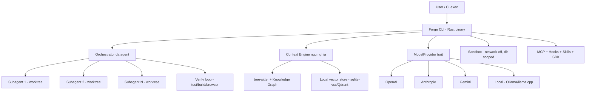

<aside>
🔨

**Tài liệu build hợp nhất** — gom toàn bộ nghiên cứu + audit + xu hướng + blueprint thành MỘT nguồn duy nhất để bắt tay xây **Forge** cùng Claude. Đọc top-down: hiểu bối cảnh → quyết định kiến trúc → lo trình build theo phiên bản.

</aside>

> **Forge** = CLI coding agent mã nguồn mở, viết bằng **Rust** (1 static binary), **model-agnostic + local-first**, **context engine ngữ nghĩa**, **đa agent song song** với long-horizon. Mục tiêu: nhẹ hơn Codex, thông minh ngữ cảnh như Augment, song song như Droid/Amp, mở như OpenHands.
> 

## 0. Cách dùng tài liệu này với Claude

- Section **1–5** là *ngữ cảnh & lý do thiết kế* (để Claude hiểu "tại sao").
- Section **6–9** là *đặc tả kỹ thuật để build* (để Claude biết "xây gì").
- Section **10** là *lộ trình theo phiên bản* `0.1xx.x` — dùng làm backlog tuần tự.
- Mọi nhận định neo vào **dữ liệu thật** (repo/docs/benchmark/arXiv) cập nhật tới **6/2026**.

---

## 1. Tóm tắt điều hành

- **Thị trường đã dịch từ "model thông minh nhất" sang "agent bền nhất"** — câu hỏi 2026 là *agent chạy tự chủ được bao lâu trước khi hỏng*. (State of AI Agents 2026)
- **Benchmark mới nhất (6/2026):** Codex CLI + GPT-5.5 dẫn đầu **Terminal-Bench 2.1 ~83.4%**; Claude Opus 4.8 dẫn đầu **SWE-Bench Verified ~88.6%**; **OpenCode ~172K GitHub stars** (agent OSS nhiều star nhất). (morphllm)
- **Bài học kiến trúc:** lõi nhẹ Rust (Codex), context engine ngữ nghĩa thắng grep (Augment), subagent cô lập + song song (Amp/Droid), model-agnostic & BYO-LLM (OpenHands), chuẩn mở MCP + AGENTS.md.
- **Forge** tổng hợp các điểm mạnh trong **một binary Rust OSS**, ưu tiên local/offline, giải trực tiếp **10 "lỗi đau"** được audit.

---

## 2. Bảng so sánh 8 công cụ (dữ liệu tới 6/2026)

| Công cụ | Runtime | Mã nguồn | Context | Đa agent | Model-agnostic |
| --- | --- | --- | --- | --- | --- |
| **Codex CLI** (OpenAI) | Rust | OSS (Apache-2.0) | Grep + AGENTS.md | Worktrees | Chủ yếu OpenAI |
| **Claude Code** | Node/TS | Đóng | Grep + hooks | Agent teams | Chủ yếu Anthropic |
| **Antigravity** (Google) | Electron fork | Đóng | Index + browser | Agent Manager | Gemini + Claude |
| **Amp** (Sourcegraph) | Node + CLI | Đóng | Codebase search | Subagent cô lập | Đa model |
| **Droid** (Factory) | CLI | Đóng | Index + 40+ MCP | Song song chuyên biệt | Anthropic + OpenAI |
| **OpenHands** | Python | OSS (MIT) | Agent SDK | Song song | BYO-LLM (bất kỳ) |
| **OpenAgents** | CLI | OSS | Workspace chung | Multi-agent network | Đa agent |
| **Auggie/Augment** | Node 22+ | Đóng | **Semantic + KG (1M+ files)** | Automations | Đa model |

### Hiệu năng & độ phổ biến

| Chỉ số | Giá trị (6/2026) | Nguồn |
| --- | --- | --- |
| Terminal-Bench 2.1 (cao nhất) | **~83.4%** — Codex CLI + GPT-5.5 | morphllm |
| SWE-Bench Verified (cao nhất) | **~88.6%** — Claude Opus 4.8 | morphllm |
| Droid — Terminal-Bench Core | **#1 ~58.75%** | Factory |
| Codex CLI GitHub stars | **~67K**, 640+ releases | Augment |
| OpenHands GitHub stars | **64K+** | arXiv 2511.03690 |
| OpenCode GitHub stars | **~172K** (OSS nhiều nhất) | morphllm |

---

## 3. Deep-dive 8 công cụ (bài học cho Forge)

- <strong>1. Codex CLI (OpenAI)</strong> — chuẩn vàng cho lõi Rust nhẹ
    - Rust, OSS Apache-2.0, sandbox **network-off + dir-scoped**, multimodal, AGENTS.md, Skills. ~67K stars; dẫn đầu Terminal-Bench 2.1 ~83.4%.
    - **Bài học:** lấy **single static binary Rust + sandbox network-off** làm nền; thay grep bằng context engine ngữ nghĩa; mở model-agnostic. (docs, repo)
- <strong>2. Claude Code (Anthropic)</strong> — orchestration & hooks
    - Agent teams; hooks `TeammateIdle`/`TaskCreated`/`TaskCompleted`; orchestrator-worker. Claude Opus 4.8 dẫn đầu SWE-Bench ~88.6%.
    - **Bài học:** học **hooks + orchestrator-worker** và cơ chế giữ main context sạch. (agent-teams, multi-agent)
- <strong>3. Google Antigravity</strong> — agent-first + browser automation
    - Agent Manager spawn đa luồng; browser automation; plan–execute–verify. VS Code fork, Gemini 3 Pro + Claude.
    - **Bài học:** đưa **verify loop bằng browser automation** vào, nhưng giữ CLI nhẹ. (Google blog)
- <strong>4. Amp (Sourcegraph)</strong> — subagent context cô lập
    - Mỗi **subagent là mini-Amp có context window riêng**, chỉ trả kết quả cuối → main context sạch; Thread Map; MCP; code review.
    - **Bài học:** **áp dụng trực tiếp mô hình subagent context cô lập**. (ampcode, manual)
- <strong>5. Droid (Factory)</strong> — song song chuyên biệt, #1 Terminal-Bench
    - Subagent chuyên biệt (Code/Knowledge/Reliability/Product); song song 6 agent mượt; 40+ MCP; `droid exec` CI/CD; tiered autonomy. #1 Terminal-Bench Core ~58.75%.
    - **Bài học:** **tự động hóa git worktree** cho song song + chế độ `exec` headless. (factory.ai, Terminal-Bench)
- <strong>6. OpenHands</strong> — OSS, BYO-LLM, Agent SDK
    - Agent SDK composable (arXiv:2511.03690); **BYO-LLM** (model local hoặc provider); CLI headless; 64K+ stars.
    - **Bài học:** **provider layer model-agnostic + local-first** là bắt buộc; cung cấp SDK. (openhands.dev, AMD)
- <strong>7. OpenAgents CLI</strong> — workspace đa agent chia sẻ
    - Workspace URL bền; shared browser/files/tunnels; @mention điều phối. Có phản hồi "messy".
    - **Bài học:** hỗ trợ **chia sẻ context qua MCP** nhưng tránh phức tạp thừa. (repo)
- <strong>8. Auggie / Augment</strong> — Context Engine ngữ nghĩa mạnh nhất
    - Index **1M+ files**, **knowledge graph real-time**, semantic search, smart curation; mở qua MCP. **Cùng model nhưng nửa hóa đơn** nhờ chỉ gửi lát cắt liên quan.
    - **Bài học:** **tái hiện context engine ngữ nghĩa nhưng OSS & local-first** — điểm khác biệt lớn nhất. (context-engine, repo)

---

## 4. Tham chiếu arXiv (căn cứ thiết kế)

- **Terminal-Bench** — 2601.11868: chỉ tính "giải quyết" khi **test pass** → Forge phải verify bằng test thật.
- **LongCLI-Bench** — 2602.14337: long-horizon repo-level → cần checkpoint + nén context.
- **Building AI Coding Agents for the Terminal / OpenDev** — 2603.05344: **harness + context engineering > bản thân model**.
- **Evaluating / Impact of AGENTS.md** — 2602.11988, 2601.20404: lợi ích phụ thuộc model; layered discovery (file gần nhất thắng). Thực nghiệm: +~4% success, giảm bug 35–55% nhưng **không nhất quán giữa model**. (HN)
- **Survey / USEagent / Agentic Engineering** — 2409.02977, 2506.14683, 2606.05608: hướng tới agent thống nhất & hệ sinh thái tự tiến hóa.

---

## 5. Audit 10 "lỗi đau" → cách Forge giải

| # | Lỗi đau | Cách Forge xử lý |
| --- | --- | --- |
| 1 | Context rot phiên dài | Nén/tóm tắt context, checkpoint, subagent cô lập |
| 2 | Grep-everything → đột biến token | Semantic retrieval chỉ nạp lát cắt liên quan |
| 3 | Hallucinate API/file, sửa nhầm | Knowledge graph verify symbol trước edit |
| 4 | "Báo xong" nhưng test fail | Verify loop bắt buộc (test/build) trước khi báo xong |
| 5 | Xung đột khi đa agent | Git worktree riêng mỗi subagent |
| 6 | Rủi ro auto-approve/sandbox | Tiered autonomy, network-off, dir-scoped |
| 7 | Runtime nặng (Node) | Rust single static binary |
| 8 | Khóa vào 1 model/cloud | Provider layer model-agnostic + local |
| 9 | Mất trạng thái task dài | Checkpoint + resume |
| 10 | AGENTS.md không ăn nhập đa model | Coi AGENTS.md tùy biến, không bắt buộc |

---

## 6. Xu hướng 2026 → 2028 (định hướng)

- **2026:** từ trí tuệ → độ bền; kỹ sư từ implementer → orchestrator; context engineering thành cốt lõi; terminal-native binary nhẹ (Node → Rust/Go).
- **2027:** đa agent song song + verify loop là **mặc định**; chuẩn mở MCP + AGENTS.md (Agentic AI Foundation/Linux Foundation, 60k+ dự án) hội tụ; model-agnostic & BYO-LLM phổ biến.
- **2028:** self-improving / "agentic engineering"; con người giám sát & ngắt thay vì duyệt từng bước; observability bắt buộc. Gartner: **33% phần mềm doanh nghiệp tích hợp agentic AI vào 2028**.

---

## 7. Kiến trúc Forge (đặc tả build)



### 7.1 Lõi Rust

- **Single static binary** — khởi động tức thì, không runtime Node/Python (lỗi #7).
- **`ModelProvider` trait** — impl OpenAI/Anthropic/Gemini + **local (Ollama/llama.cpp)** (lỗi #8).
- **Harness** vòng lặp tool–observe–act (OpenDev arXiv:2603.05344).
- **Sandbox** network-off + dir-scoped + **tiered autonomy** (lỗi #6).

### 7.2 Context Engine ngữ nghĩa (local)

- **tree-sitter** parse AST → **knowledge graph** symbol/quan hệ (Augment).
- **Local vector store** (sqlite-vss/Qdrant nhúng) — chỉ nạp lát cắt liên quan (lỗi #2).
- **Incremental sync** theo file watcher; **verify symbol trước edit** (lỗi #3).

### 7.3 Orchestrator đa agent + long-horizon

- **Subagent context cô lập** (Amp) → main context sạch (lỗi #1).
- **Git worktree tự động** mỗi subagent (Droid) (lỗi #5).
- **Checkpoint + resume** (lỗi #9); **verify loop bắt buộc** test/build/browser (lỗi #4).

### 7.4 Hệ mở rộng

- **MCP server/client** + **hooks** (Claude Code) + **skills** + **SDK** nhúng.
- **AGENTS.md tùy biến** (không bắt buộc), layered discovery (lỗi #10).
- **`forge exec`** headless cho CI/CD.

---

## 8. Cấu hình `forge.toml`

```toml
# forge.toml
[provider]
default = "anthropic"
fallback = ["openai", "local"]

[engine]
mode = "semantic"        # semantic | grep
index_on_start = true

[agents]
max_parallel = 6
subagent_context = "isolated"

[sandbox]
network = "off"
scope = "workdir"
autonomy = "tiered"      # readonly | tiered | full
```

## 9. Cấu trúc dự án đề xuất (Rust workspace)

```
forge/
├─ crates/
│  ├─ forge-cli/        # entrypoint, parse args, REPL/exec
│  ├─ forge-core/       # event loop, diff-edit, streaming
│  ├─ forge-provider/   # ModelProvider trait + impls
│  ├─ forge-context/    # tree-sitter index, KG, vector store
│  ├─ forge-agents/     # orchestrator, subagent, worktree
│  ├─ forge-sandbox/    # network-off, dir-scope, autonomy tiers
│  ├─ forge-verify/     # test/build/browser verify loop
│  └─ forge-ext/        # MCP, hooks, skills, SDK
├─ forge.toml
└─ AGENTS.md
```

---

## 10. Lộ trình build theo phiên bản (`0.1xx.x`)

| Phiên bản | Mốc | Phạm vi | Giải lỗi đau |
| --- | --- | --- | --- |
| **v0.001.1** | MVP (0→1) | Lõi Rust + 1 provider + edit/run + sandbox + AGENTS.md | #6, #7 |
| **v0.001.2** | Context | Context engine ngữ nghĩa + tree-sitter + KG | #2, #3 |
| **v0.001.3** | Sync | Incremental sync + verify symbol trước edit | #3 |
| **v0.001.4** | Đa agent | Orchestrator + subagent cô lập + git worktree | #1, #5 |
| **v0.001.5** | Long-horizon | Checkpoint/resume + verify loop bắt buộc | #4, #9 |
| **v0.001.6** | Mở rộng | MCP/hooks/skills + headless exec + multi-provider (gồm local) + observability | #8, #10 |

<aside>
✅

**Điểm khác biệt cốt lõi:** nhẹ như Codex (Rust), context engine ngữ nghĩa như Augment **nhưng OSS & local-first**, đa agent như Droid/Amp, model-agnostic như OpenHands — tất cả trong **một binary duy nhất**.

</aside>

<aside>
🔨

**Bước tiếp theo với Claude:** bắt đầu từ **v0.100.0** — dựng Rust workspace theo mục 9, impl `ModelProvider` cho 1 provider, vòng lặp tool–observe–act + diff-edit + sandbox network-off. Mỗi phiên bản là một milestone backlog tuần tự.

</aside>